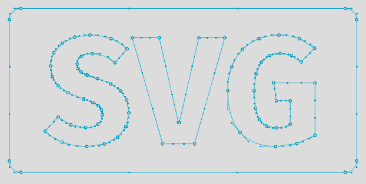

# NanoSVG 2: Rise of the Slop

A C++23 SVG parser and rasterizer derived from NanoSVG, featuring `double` precision, owned containers, and a C compatibility API. Version 2.0.0 introduces source and binary compatibility changes; see migration notes below.

## Parser



The parser converts SVG shapes into cubic Bezier paths for uses such as editor icons and game graphics.

* Geometry is transformed by the SVG transforms and `viewBox`, then converted to `px`, `pt`, `pc`, `mm`, `cm`, or `in`.

* DPI controls physical-unit conversion; defaults are `px` and 96 DPI.

* Use `parse_file(path)` for files or `parse(svg_text)` for strings. Both return `std::expected<std::unique_ptr<Image>, Error>` and independently own their data.

* Supports paths, basic shapes, transforms, fills, strokes, and gradients. Text, images, clipping paths, masks, and filters are not supported.


## Rasterizer


The rasterizer turns parsed shapes into pixels to bake icons into textures.

* Supports fills, strokes, dashes, and linear/radial gradients with `pad`, `repeat`, and `reflect` spread modes.

* `rasterize(image, options)` returns a `std::vector<Rgba8>` of tightly packed RGBA pixels with straight (non-premultiplied) alpha.

* `RasterOptions` specifies the destination dimensions, a uniform `scale`, and an `offset`.


## Example Usage

```cpp
#define NANOSVG_IMPLEMENTATION
#define NANOSVGRAST_IMPLEMENTATION
#include "nanosvgrast.hpp"
#include <algorithm>
#include <cmath>
#include <cstdio>
#include <utility>

int main() {
    auto parsed = nanosvg::parse_file("example/nano.svg");
    if (!parsed) return 1;
    const auto& image = **parsed;
    if (!std::isfinite(image.width) || !std::isfinite(image.height) ||
        image.width <= 0 || image.height <= 0) return 1;

    const double scale = std::min(256.0 / image.width, 256.0 / image.height);
    auto rendered = nanosvg::rasterize(image, {
        .width = 256, .height = 256,
        .offset = {(256.0 - image.width * scale) / 2,
                   (256.0 - image.height * scale) / 2},
        .scale = scale
    });
    if (!rendered) return 1;
    auto output = std::move(*rendered); 
    std::printf("%d x %d (%zu RGBA pixels)\n",
                output->width, output->height, output->pixels.size());
    return 0;
}

```

## Using NanoSVG in your project

Copy `src/nanosvg.hpp` and `src/nanosvgrast.hpp` to your project. Define the implementation macros in exactly one C++23 translation unit before including the headers:

```cpp
#define NANOSVG_IMPLEMENTATION
#include "nanosvg.hpp"
#define NANOSVGRAST_IMPLEMENTATION
#include "nanosvgrast.hpp"

```

* **Color Keywords:** Define `NANOSVG_ALL_COLOR_KEYWORDS` before the parser implementation to enable the full SVG color-keyword table.

* **Build Systems:** CMake (3.25+) and Xmake are natively supported. Use `find_package(NanoSVG 2 REQUIRED)` and `target_link_libraries(myapp PRIVATE NanoSVG::nanosvgrast)` for CMake.


## C API and Migration

C callers include `nanosvg.h` and `nanosvgrast.h`.

* Version 2 changes numeric parameters and geometry from `float` to `double`, and makes `NSVGgradient::stops` an owned pointer.

* Rebuild every consumer and update point pointers and allocation sizes.

* Native C++ users now call `rasterize(image, options)` instead of creating a persistent `Rasterizer`.

* Release C images with `nsvgDelete` and rasterizer handles with `nsvgDeleteRasterizer`.


## License

This library is licensed under the [zlib license](https://www.google.com/search?q=LICENSE.txt&utm_source=gemini). Original notices are retained; this is an altered C++23 version of NanoSVG.